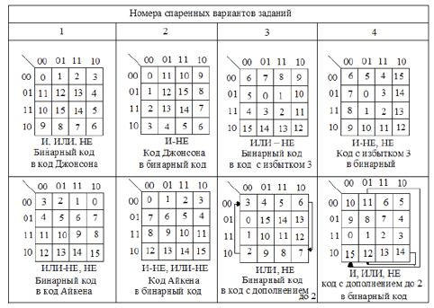

# Домашнее задание к разделу «Комбинационные схемы»: Преобразователи кодов (бинарный ↔ циклический)

## 1. Задание




1. В соответствии с номером варианта взять карту Карно.  
2. По заданной карте Карно составить таблицу истинности, отображающую преобразование **бинарного кода в циклический код**.  
3. Синтезировать логическую структуру (получить минимизированные выражения для каждого выходного бита) преобразователя бинарного в циклический.  
4. Реализовать полученную структуру на Verilog.  
5. С помощью testbench снять таблицу истинности (подать все возможные входные комбинации, вывести на консоль или во временную диаграмму) и убедиться в правильности работы.  
6. Синтезировать структуру преобразователя **циклический код в бинарный** (обратное преобразование).  
7. Реализовать его на Verilog, проверить таблицу истинности.  
8. В соответствии с номером варианта из таблицы взять заданный **базис** (например, И-НЕ, ИЛИ-НЕ) и **тип преобразователя**.  
9. Составить структуру заданного преобразователя в нужном базисе, реализовать на Verilog (используя только элементы выбранного базиса), снять таблицу истинности, убедиться в правильности.

> **Примечание:** Пункты 1–3 выполняются «на бумаге». Пункты 4–9 – моделируются в симуляторе.

---

## 2. Краткие теоретические сведения

### 2.1. Циклический код (код Грея)

Циклический код (код Грея) – такой код, в котором любые две соседние кодовые комбинации отличаются только в одном разряде. Это свойство используется в измерительных системах, датчиках положения, для уменьшения ошибок при смене показаний.

**Пример для 3 бит:**

| Двоичный (A2 A1 A0) | Циклический (G2 G1 G0) |
|---------------------|------------------------|
| 000                 | 000                    |
| 001                 | 001                    |
| 010                 | 011                    |
| 011                 | 010                    |
| 100                 | 110                    |
| 101                 | 111                    |
| 110                 | 101                    |
| 111                 | 100                    |

**Формулы преобразования (для произвольной разрядности):**

- Прямое (bin → Gray):  
  `G[i] = bin[i] XOR bin[i+1]`, причём для старшего бита `bin[n] = 0` (или `G[n-1] = bin[n-1]`).

- Обратное (Gray → bin):  
  `bin[n-1] = G[n-1]`;  
  `bin[i] = G[i] XOR bin[i+1]` (рекуррентно, начиная со старшего разряда).

---

## 3. Методика выполнения на Verilog

### 3.1. Этап 1: Моделирование преобразователя бинарный в циклический (по готовым логическим формулам)

Если формулы уже получены из карт Карно (например, для 3-битного случая):

```
G2 = A2
G1 = A2 XOR A1
G0 = A1 XOR A0
```

Тогда Verilog-модуль можно записать:

```verilog
module bin_to_gray (
    input  [2:0] bin,
    output [2:0] gray
);
    assign gray[2] = bin[2];
    assign gray[1] = bin[2] ^ bin[1];
    assign gray[0] = bin[1] ^ bin[0];
endmodule
```

**Testbench для вывода таблицы истинности:**

```verilog
`timescale 1ns / 1ps
module bin_to_gray_tb();
    reg [2:0] bin;
    wire [2:0] gray;
    
    bin_to_gray dut (bin, gray);
    
    initial begin
        $display("Bin -> Gray");
        $display("A2 A1 A0 : G2 G1 G0");
        for (int i = 0; i < 8; i++) begin
            bin = i;
            #10;
            $display("%b %b %b : %b %b %b", bin[2], bin[1], bin[0],
                                              gray[2], gray[1], gray[0]);
        end
        $finish;
    end
endmodule
```

Запуск:  
```bash
iverilog -o tb.vvp bin_to_gray_tb.v bin_to_gray.v
vvp tb.vvp
```

На консоль будет выведена таблица истинности.

### 3.2. Этап 2: Моделирование преобразователя циклический в бинарный (по формулам)

```verilog
module gray_to_bin (
    input  [2:0] gray,
    output [2:0] bin
);
    assign bin[2] = gray[2];
    assign bin[1] = gray[2] ^ gray[1];
    assign bin[0] = gray[2] ^ gray[1] ^ gray[0];
endmodule
```

Аналогичный testbench.

### 3.3. Этап 3: Реализация в заданном базисе (например, только NAND)

Если требуется реализовать функцию `F = (A & B) | (~C)` в базисе И-НЕ, нужно преобразовать выражение к виду, использующему только операцию `nand`. В Verilog можно использовать непрерывные присваивания с `~&` (nand) или примитивы `nand`.

**Пример модуля XOR на NAND:**

```verilog
module xor_nand (a, b, y);
    input a, b;
    output y;
    wire w1, w2, w3;
    nand (w1, a, b);
    nand (w2, a, w1);
    nand (w3, b, w1);
    nand (y, w2, w3);
endmodule
```

Если задан базис **ИЛИ-НЕ**, нужно использовать примитив `nor`.

**Важно:** При реализации в заданном базисе нельзя использовать встроенные операторы `&`, `|`, `^` (кроме случаев, когда они разрешены). Допускается использование только `assign` с комбинацией `~&` (для И-НЕ) или `~|` (для ИЛИ-НЕ), либо явное инстанцирование примитивов.

---

## 4. Пример выполнения (на основе 3-битного варианта)

### 4.1. Карта Карно (условная)

Пусть для прямого преобразования бинарный → циклический задана следующая карта Карно для младшего разряда G0. После минимизации получена функция:  
`G0 = A1 XOR A0`.  
Для G1: `G1 = A2 XOR A1`.  
Для G2: `G2 = A2`.

Тогда код модуля – как в п.4.1.

### 4.2. Проверка таблицы истинности (консольный вывод)

При запуске testbench выводится:

```
Bin -> Gray
A2 A1 A0 : G2 G1 G0
0 0 0 : 0 0 0
0 0 1 : 0 0 1
0 1 0 : 0 1 1
0 1 1 : 0 1 0
1 0 0 : 1 1 0
1 0 1 : 1 1 1
1 1 0 : 1 0 1
1 1 1 : 1 0 0
```

Это совпадает с теоретической таблицей кода Грея.

### 4.3. Реализация в базисе И-НЕ для обратного преобразователя

Возьмём обратное преобразование (Gray → bin) для 3 бит:  
`B2 = G2`  
`B1 = G2 ^ G1`  
`B0 = G2 ^ G1 ^ G0`

Выразим XOR через NAND (см. выше). Создадим модуль, состоящий из примитивов `nand`. После синтеза получим структурное описание.

---

## 5. Содержание отчёта по домашнему заданию

Отчёт должен быть оформлен в электронном виде (Markdown или PDF) и содержать:

1. **Титульный лист** с названием работы, ФИО, группой, вариантом.
2. **Исходную карту Карно** (скан или рисунок) и таблицу истинности, составленную по ней для прямого преобразования.
3. **Минимизированные логические выражения** для каждого выходного бита (для прямого и обратного преобразования).
4. **Verilog-код** прямого преобразователя и testbench (с выводом таблицы на консоль).
5. **Результат работы** – скриншот вывода таблицы истинности из консоли (или копия).
6. **Verilog-код** обратного преобразователя и его testbench, таблица истинности.
7. **Структурная схема** (по желанию) или описание реализации в заданном базисе, Verilog-код модуля (только на элементах базиса), testbench.
8. **Выводы** о работоспособности преобразователей, сравнение с теоретической таблицей Грея.
9. **Ответы на контрольные вопросы** (ниже).
